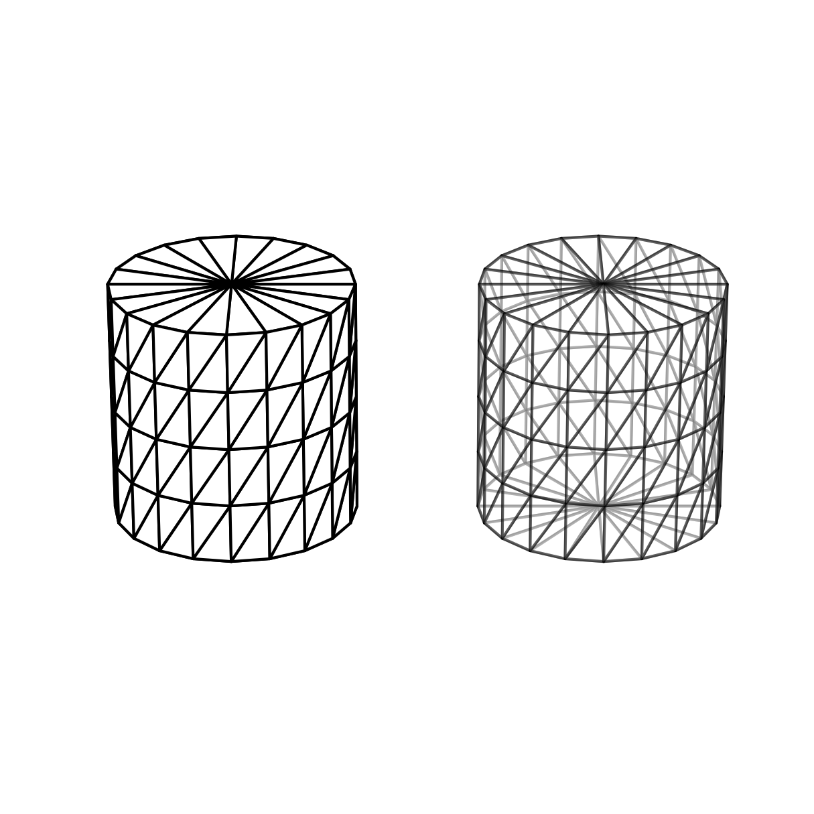
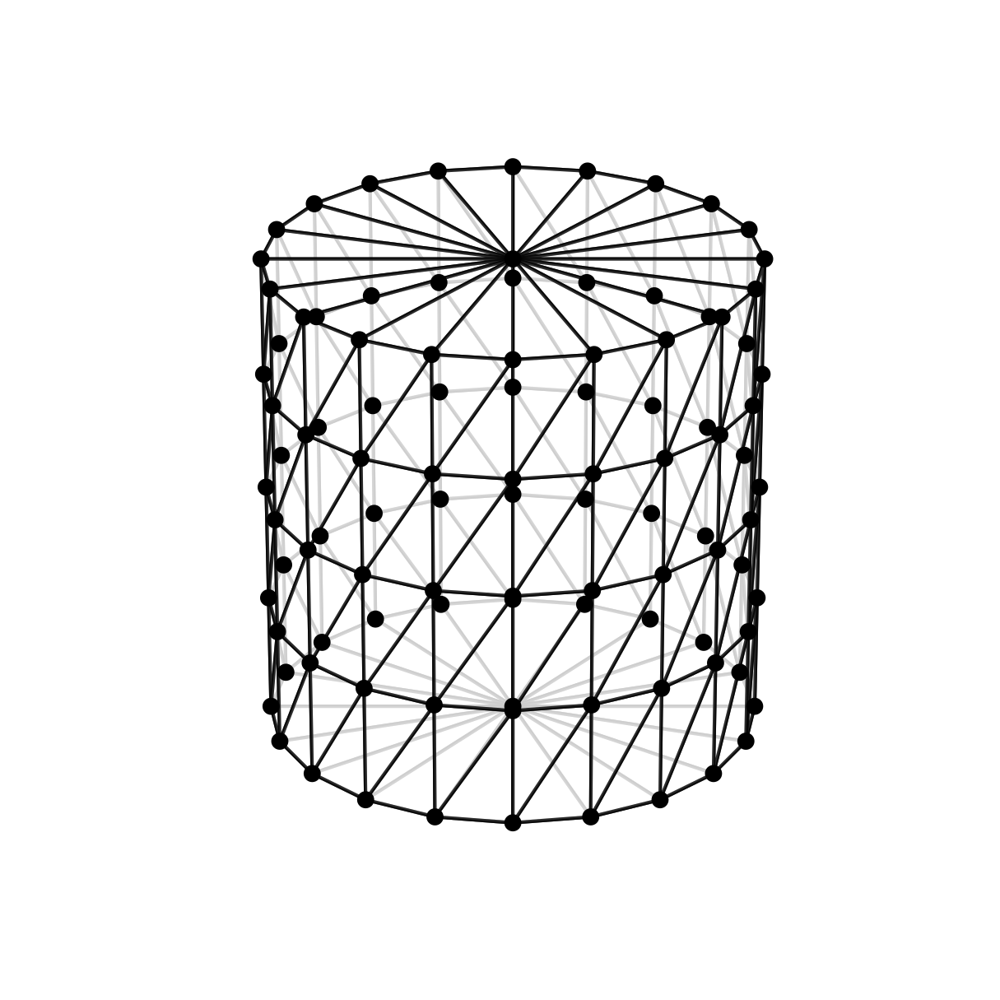
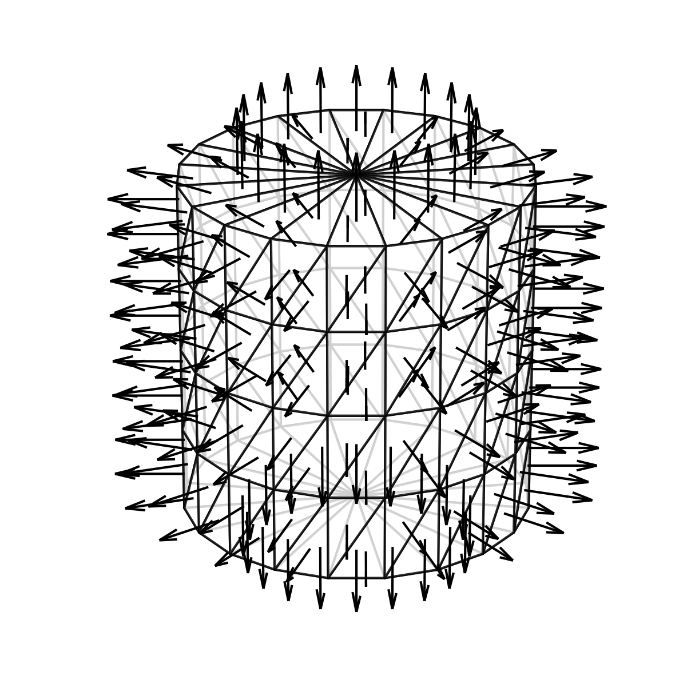
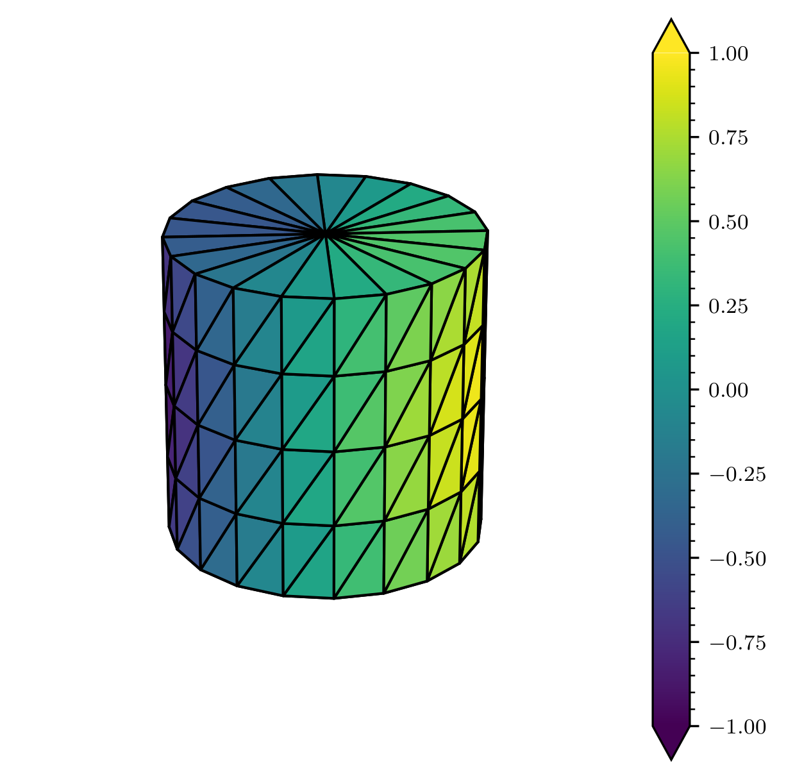

# Geometric Plotter

A tiny project to plot triangle meshes with matplolib in order to export as *\*.pdf* and *\*.eps* with $\LaTeX$ support. 

Notably, the plots are setted to preserved the box aspect and it is possible to set vertex values in `trisurf_plot`. Internally, it computes the triangle color by barycentric interpolation.

### Usage
```python
from geometric_plotter import Plotter

Plotter.set_export() # [un]comment this line when you want save or show the figures.

p = Plotter(figsize=(5,5)) # pass kwargs of plt.figure

# ... add plots here
p.add_trisurf( ... )
p.add_scatter( ... )
p.add_quiver( ... )

p.camera(view=(25, 0, 0), zoom=1.) # set camera view & zoom
p.save(folder='figs/', name='example') # set path to save png/pdf/eps

Plotter.show() # always exec this line
```

### Examples

#### `translate` & `alpha` 
```python
p = Plotter(figsize=(5,5))
p.add_trisurf(vertices, triangles, alpha=1)
p.add_trisurf(vertices, triangles, alpha=.5, translate=(0,-3,0))
p.camera(view=(25, 0, 0), zoom=1.)
p.save(folder='figs/', name=f'trisurf')
```


#### `scatter` & `trisurf`
```python
p = Plotter(figsize=(5,5))
p.add_trisurf(vertices, triangles, alpha=.8)
p.add_scatter(vertices, color='k', s=100, alpha=1)
p.camera(view=(25, 0, 0), zoom=1.)
p.save(folder='figs/', name=f'scatter')
```



#### `normals` & `trisurf`

```python
p = Plotter(figsize=(5,5))
p.add_trisurf(vertices, triangles, alpha=.8)
p.add_normals(vertices, triangles, color='k', length=.4, alpha=1)
p.camera(view=(25, -45, 0), zoom=1.)
p.save(folder='figs/', name=f'normals')
```



#### `colorbar` & `trisurf`

```python
f = np.cos(φ)*np.sin(θ)

p = Plotter(figsize=(5,5))
p.add_trisurf(vertices, triangles, alpha=1, vertex_values=f, vmin=f.min(), vmax=f.max(), colorbar=True)
p.camera(view=(25, -75, 0), zoom=1.)
p.save(folder='figs/', name=f'{filename}')
```

